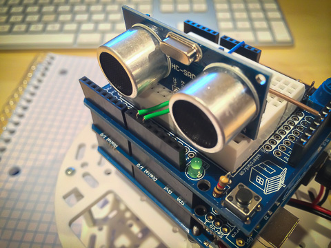

#Wallie

## A Collection of Sketches

This is a collection of sketches for a Wallie-like two-wheeled bot - i.e. a surface moving robot that interacts with the world - that is controlled using the ubiquitous Arduino Uno microcontroller board.

Each subfolder contains a sketch and some documentation about the robot config the sketch ran on.

All examples are actual sketches that were used with a real robot. Each is basically a snap shot of my progression with developing Wallie.

## Using the Sketches

If you want to adapt any of these sketches to your own projects keep in mind that you will most likely need to make modifications to get the code to work for your specific hardware. I try to abstract out as much of the device specific code as possible so it should be relatively easy to adapt the code - after all I'll probably need to adapt the code myself as I change systems over time.

Currently the following systems/hardware are used for most of the examples:

* The [Adafruit Motor V2 Shield](http://learn.adafruit.com/adafruit-motor-shield-v2-for-arduino) is used to drive the wheel motors.
* El Cheapo HC-SR04 Sonic Range Sensor
* TowerPro SG-50 Micro Servos
* [Pololu Qik2s9v1](http://www.pololu.com/product/1110) motor controller 
* [Pololu Wheel Encoders](http://www.pololu.com/product/1217) motor controller 
* [Pololu's Zumo Kit](http://www.pololu.com/product/2505)
* [Pololu's 100:1 HP metal micro-gear motors with extended shaft](http://www.pololu.com/product/2214)
* [Pololu's optical encoders](http://www.pololu.com/product/2590)
* [Adafruit's V5 Trinket](http://www.adafruit.com/products/1501)

##The Sketches

 * **SpinBot** - The "Hello World!"" of robotic movement. Simply spins in place. (Like you need a sketch for that)
 
 * **WallBot V1** - Uses sonic sensor to avoid crashing into walls.
 
 * **WallBot V2** - Sonic sensor mounted on a servo.

 * **WallBot V3** - PID Control  
   * Added Quadrature encoders
   * Added PID control to maintain straight line motion
   * New dedicated motor controller
 * **WallBot V4** - Completely new hardware
   * Added Reflectance sensor array
   * Has compass
 
##Up Coming Projects/Hardware

 * Moving to an RTOS kernel
 * Wireless communication and control