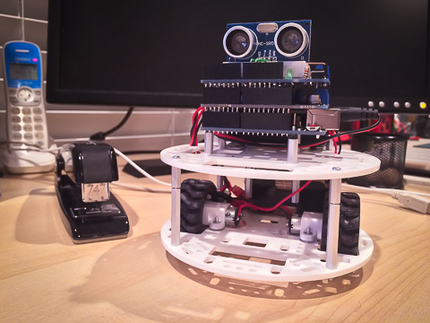

#WallBot Version 1

Basic two-wheel bot with a forward facing sonic sensor. I used the HC-SR04. The motors are controlled by an Adafruit Motor Shield V2. I also did a blog post about the setup: [http://wp.me/p493sy-4N](http://wp.me/p493sy-4N)

I call him a wall bot because he's only good at avoiding walls.

##The Sensor

The sensor works by emitting a series of sound pulses when the "trig" pin is driven high for 10 us. The "echo" pin then goes high until an echo is heard. Here is the code I use to read it:

	// returns 100ths of inches
	int readDistance()
	{
		// reset trig pin
  		digitalWrite(trigPin, LOW);
  		delayMicroseconds(2);
  		// pulse trig pin
  		digitalWrite(trigPin, HIGH);
  		delayMicroseconds(10);
  		digitalWrite(trigPin, LOW);
  		// read duration till echo
  		long duration = pulseIn(echoPin, HIGH, 60000);
  		return duration ? (int)((duration*50L)/74L) : 10000;
	}

The **pulseIn()** function returns the time (in microseconds) that the echoPin stays high. It will time-out after 6000 us and return 0 as the result.

One thing to note is that **readDistance()** cannot be called too rapidly so make sure to ensure at least a 100 ms delay between calls.

Here is a short clip of the bot trying to avoiding walls: [http://www.youtube.com/watch?v=LyVRZNFcckg](http://www.youtube.com/watch?v=LyVRZNFcckg)

##Notes

Some issues that stand out:

 * Wallie does not travel in a straight line. In the code I had to adjust the relative speeds of the motors.
 
 * The sensor is not effective when at oblique angles to surfaces.
