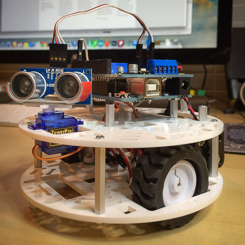

#WallBot Version 2

For my next version of WallBot I mounted the sonic sensor onto a servo.

You can see a short clip of WallBot2 in action: [here](http://youtu.be/Zw35PRs5OC0)

I explain a bit more about the build and the code [here](http://solderspot.wordpress.com/2014/01/12/wall-bot-version-2/)
 
##The Servo

The HC-SR04 sensor is mounted on the servo using double-sided foam tape. Works really well.

I used the Arduino's Servo library to drive the physical servo and my own SS_Servorator and SS_ServoTrim libraries to provide speed control and fine adjustments to the servo pulse timing.

First include the needed library headers.

	#include <SS_Servorator.h>
	#include <SS_ServoTrim.h>
	#include <Servo.h>
	:
	:

Instance the servo objects. The code is setup for multiple servos, even though in this case there is only one.

	// Servo control using Servo, SS_Servorator and SS_ServoTrim libraries
	#define NUM_SERVOS 1

	Servo servo[NUM_SERVOS];
	SS_Servorator sr(NUM_SERVOS);
	SS_ServoTrim trim(NUM_SERVOS);
	:
	
Define a min and max angle for the servo sweep

	:
	SS_Angle min_angle = SS_DEGREES(45);
	SS_Angle max_angle = SS_DEGREES(155);
	:
	
In setup() we initialize the various systems
	
	void setup()
	{
 		:
 		:
 		// assign PWM pins to servos
 		servo[0].attach(3);

		// register servo handler
 		sr.setServoHandler( update_servo, NULL);

 		// set initial position and speed of servo
 		sr.setServoTargetAngle( 0, SS_DEGREES(90));
 		sr.setServoMaxVelocity( 0, SS_NORMAL_RATE*2 );

 		// set up trims so servo ranges are correct
 		trim.setServoPulseRange( 0, 500, 2500);

 		// wait for servo to get into starting position
 		while ( sr.getServoAngle(0) != SS_DEGREES(90))
 		{
 			sr.service();
 		}

 		//delay a second so we can verify the servo is correctly centered
 		// if not use the trim to adjust center point.
 		delay(1000);
 		:
 		:
	}

Provide a servo handler for SS_Servorator

	:
	:
	// the servo handler for Servorator
	void update_servo( SS_Index index, SS_Angle angle, void *data)
	{
 		// SS_Angle is in 1000th of a degree
 		long time = trim.getServoPulseTime(index, angle);
 		servo[index].writeMicroseconds( time );
	}

	:
	:

In loop() we need to make a call to control_servos()

	void loop()
	{
 		:
 		:
 		control_servos()
 		:
 		:
	}

And the function itself. It sweeps the servo from min to max angle as long as we are not turning.

	void control_servos()
	{
 		if( state != TURNING )
 		{

 			SS_Angle target = sr.getServoTargetAngle(0);

 			if( target != min_angle && target != max_angle )
 			{
 				// set target to the furthest angle
 				if( target - min_angle > max_angle -target )
 				{
 					sr.setServoTargetAngle( 0, min_angle );
 				}
 				else
 				{
					sr.setServoTargetAngle( 0, max_angle );
 				}
 			}
 			else
 			{

 				SS_Angle angle = sr.getServoAngle(0);

 				if ( angle <= min_angle)  
 				{  
 					sr.setServoTargetAngle(0, max_angle);
 				}  
 				else if ( angle >= max_angle)
 				{
 					sr.setServoTargetAngle(0, min_angle);
 				}
 			}
 			sr.setServoMaxVelocity( 0, SS_DEGREES(120));
 		}

 		// sr.service() needs to be called regularly so that
 		// the servos are updated via update_servo()
 		sr.service();
	}

In the turn function we move the servo to a fix position depending on which way we are turning. The ideas is to point the sensor towards the wall we are turning away from.

	void turn()
	{
 		:
 		sr.setServoTargetAngle( 0, dir == LEFT ? SS_DEGREES(155) : SS_DEGREES(45) );
 		sr.setServoMaxVelocity( 0, SS_DEGREES(60));
 		:
	}

##Notes

 * Definite drop in the accuracy of the sonic sensor. Not sure if that is due to the noise of the servo, or the angular moment of the sensor, or both.
 
 * Servo motion is very choppy due to the blocking nature of the code - Next step is to use an RTOS to allow multitasking. While converting over to RTOS will be an undertaking, in the end it will greatly simplify coding. Already with just managing motors, one servo and one sensor the code is getting dense.
 
 * The collision avoidance has been greatly improved with relatively simplistic logic. I was surprised how much better it did over version 1.
 
  * If you decide to use this code then you'll need to adjust the trim settings, servo speeds and angles so that it works best for your particular setup.
  
##Warning

It is possible you could damage your servo by giving it extreme pulse timings. Use this code at your own risk.