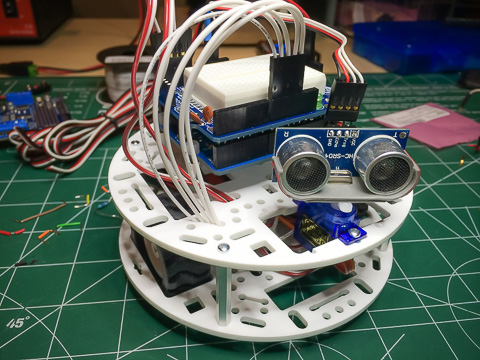

#WallBot Version 3

A lot happened this revision.

 * Added wheel encoders
 * New dedicated motor controller
 * Added PID control to motor logic

The initial goal was to make WallBot drive in straight lines. Up till now I've had to fudge the left and right motor values to compensate for the differences in each motor's performance.

The longer term goal is to equip WallBot for dead-reckoning and general navigation, such as maze/room mapping.

You can read details about the build for V3 [here](http://solderspot.wordpress.com/2014/01/16/wallbot-version-2-5/)
 
 
##The Encoders

 

Each wheel has an encoder with two signals, A and B. They use [Gray code](http://en.wikipedia.org/wiki/Gray_code) to provide information about how fast and in what direction each wheel is rotating.

I was not able to use Pololu's libraries to read the encoders. Their libraries conflicted with the Arduino's SoftwareSerial library which, ironically, I was using to communicate with Pololu's other device I'm using, their Qik motor controller.

I finally figured out how to program the Atmel's Timer2 to generate an interrupt every millisecond.
	
	void setup_encoder()
	{
		cli();
		// set timer2 interrupt at 1000 Hz
		// we are assuming a clk speed of 16MHz
		TCCR2A = 0;
		TCCR2B = 0;
		TCNT2  = 0;
		OCR2A = 249;
		TCCR2A |= (1 << WGM21);
		TCCR2B |= (1 << CS22);   
		TIMSK2 |= (1 << OCIE2A);
		sei();
	}

	ISR(TIMER2_COMPA_vect)
	{
		// this routine gets called once every 1 millisecond
		_counter++;
		:
		// read and process encoder signals
	}

The timer code assumes the processor is clocked at 16MHz. With the millisecond interrupt we can sample the encoder singles and capture any changes in them.

Decoding the encoder signals is relatively simple but not intuitive. Took me some time to wrap my head around it.

The meat of the code is this function:

	void _process( char Apin, char Bpin, char *lastA, char *lastB, volatile int16_t *ticks )
	{
		char A = (digitalRead( Apin) == HIGH) ? 1 : 0;
		char B = (digitalRead( Bpin) == HIGH) ? 1 : 0;
		char lA = *lastA;
		char lB = *lastB;
		char dA = A!=lA;
		char dB = B!=lB;

		if( dA && dB )
		{
			// both should not change at the same time
			_error = true;	
		}
		else if ( dA || dB )
		{
			if (A^lB) 
			{
 				*ticks += 1;
			}
			else if(B^lA)
			{
				*ticks -= 1;
			}
		}
		*lastA = A; 
		*lastB = B;
	}

##PID Control

I wrote a simple PID based controller that measures the difference between the rotation of both wheels, while the bot is meant to be traveling straight forward, and adjusts the relative speeds of each motor to minimize rotational differences, if there are any.

Again, the meat of the code is:

	#define Kp    1000L	
	#define Ki    1000L	
	#define Kd    0L

	get_ticks_since_last( &lticks, &rticks, &ms);

	if ( ms > 0 )
	{
    	// we assume wheels are turning in the same direction
    	int16_t dir = ( lticks < 0 || rticks < 0) ? -1 : 1;

    	// make the values positive
    	lticks *= dir;
    	rticks *= dir;

    	diff = lticks - rticks;

    	// we want the difference to be 0

    	if ( !diff)
    	{
      		// that was easy
      		return;
    	}

    	// track the integral 
    	_pid_sumErrs += diff;

    	// get the differential
    	delta = (int32_t) (diff - _pid_lastErr);

	    int16_t P = (int16_t) ((Kp*((int32_t)diff) + Ki*((int32_t)_pid_sumErrs) + (Kd*delta*1000L)/ms)/1000L);
		_pid_lastErr = diff;

    	// a positive error means the left motor is 
    	// turning more than the right so adjust 
    	// each motor accordingly
    	int adjust = (P/2)*dir;
    	adjustLMotor = -adjust;
    	adjustRMotor = adjust;
    	updateMotors();
	}

You can see a short clip of the PID Controller in action [here](http://youtu.be/i_lpRRQq7OE)

One of the ways I tested the controller logic was to simulate a left/right motor imbalance using software. I added an LMotoGain variable that was used to modify the power setting of the left motor. So while the bot thinks it is setting the left and right motors to the same power level, in actual fact they are different.

	// PID - use this make the left motor more
	// powerful or less powerful than the right motor.
	// Value is as a percentage, i.e. 110 means left
	// motor will be 10% faster than the right. 90
	// would mean the left motor is 10% slower
	int LMotorGain        = 130;
 	:
 	:
 	int lspeed = ((LMotorSpeed+adjustLMotor)*LMotorGain)/100;
	int rspeed = (RMotorSpeed+adjustRMotor);

So a value of 130 will result in the left motor always being 30% more power than the right motor.

##Notes

After playing around with V3 I notice some issues:

 * I should be adjusting the `adjust[L|R]Motor` variables and not setting them, i.e.
 		
 		adjustLMotor -= adjust;
 		adjustRMotor += adjust;
after I made that change the PID control worked much better. I added this change to V3.
 		
 * I need to provide gentle acceleration to the motor logic. When the bot starts moving forward from a standstill there is a sudden jolt of movement and the wheels can lose traction for a moment, resulting in the bot going off center. There is no way for the PID to detect and correct for that.
 
 *   Need to see if making the adjust[L|R]Motor variables percentage modifiers, rather than absolute modifiers, will be better for handling all ranges of motor speeds. Using absolute modifiers means that their effects are larger at low speeds and lesser at higher speeds.
 
 * There is not a whole lot of resolution to the ticks and the motor levels which seems to make the PID control very course. I think the main problem is the speed control only having a resolution of 127.
 
 * I need to add some kind of wireless communication to the bot. It would be much simpler to view PID values in realtime and also be able to modify parameters without having to tether the bot to the computer each time I want to tweak something.
 
 * Ended up with Kp = 1.5, Ki = 0.9 and Kd = 0. 

I also modified the PID controller to be able to sample longer periods of time to see what kind of effect that can have on the porcess. 		
