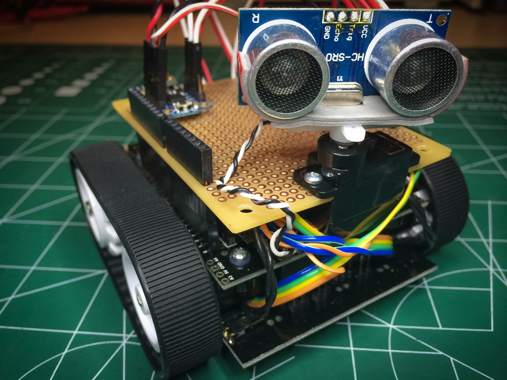

#WallBot Version 4

This version of WallBot is a complete redo using Pololu's Zumo chassis and shield.

I've documented the development and build of the bot in these posts:

 * [Zumo Build - Part I](http://wp.me/p493sy-aI)
 * [Zumo Build - Part II](http://wp.me/p493sy-be)
 * [Zumo Build - Part III](http://wp.me/p493sy-bG)
 * [Zumo Build - Part IV](http://wp.me/p493sy-cw)

Parts list:
-----------

 * [Pololu's Zumo Kit](http://www.pololu.com/product/2505)
 * [Pololu's 100:1 HP metal micro-gear motors with extended shaft](http://www.pololu.com/product/2214)
 * [Pololu's optical encoders](http://www.pololu.com/product/2590)
 * Small/micro servo
 * Sonic Sensor - HC-SR04
 * [Adafruit's V5 Trinket](http://www.adafruit.com/products/1501)

Overview
--------

The Trinket acts as an I2C slave and controlls the front servo and sonic sensor.

The Arduino sits on the chassis shield and controller the motors and reads the wheel encoders.

In Version 5 I was able to get all the systems working on just the Arduino, so this version is of interest only for the Trinket implementation.

I plan to breakout the Trinket code and make it a stand-alone library as having an independently controller sensor on a servo might be of general use to others, if only for reference.

Even though the encoders are functional I did not enable or tune the PID controller. 

Reference
=========

Arduino Pin Assignments
-----------------------

| Pin | Assignment              | Notes                             |
|:---:|-------------------------|-----------------------------------|
| 0   | USB/Serial/Bluetooth    | external comms                    |
| 1   | USB/Serial/Bluetooth    | external comms                    |
| 2   |                         |                                   |
| 3   |                         |                                   |
| 4   | IR Array Sensor (L)     | left side sensor                  |
| 5   | IR Array Sensor (R)     | right side sensor                 |
| 6   |                         |                                   |
| 7   | Right Motor Direction   |                                   |
| 8   | Left Motor Direction    |                                   |
| 9   | Right Motor PWM         |                                   |
| 10  | Left Motor PWM          |                                   |
| 11  | IR Array Sensor (M)     | middle-left sensor                |
| 12  | Push Button             | toggle PID or stop/start bot      |
| 13  | Yellow LED              | indicates PID control             |
| A0  | Right Encoder (A)       |                                   |
| A1  | Right Encode (B)        |                                   |
| A2  | Left Encode (A)         |                                   |
| A3  | Left Encode (B)         |                                   |
| A4  | SDA                     | I2C                               |
| A5  | SCL                     | I2C                               |

Trinket Pin Assignments
-----------------------

| Pin | Assignment              |
|:---:|-------------------------|
| 0   | SDA on Arduino (A4)     |
| 1   | Servo PWM               |
| 2   | SCL on Arduino (A5)     |
| 3   | Sonic Trig              |
| 4   | Sonic Echo              |

Trinket Registers
-----------------

| Index | Register Name          | Description                            | Value/Range          |
|:-----:|------------------------|----------------------------------------|----------------------|
| 0     | TRKT_STATUS            | Current status of slave                | 1 = READY            |
| 1     | TRKT_SONIC_DISTANCE    | Current distance from sensor           | 0..255 inches        |
| 2     | TRKT_SERVO_MODE        | Current servo mode                     | 0 = Sweep, 1 = Fixed |
| 3     | TRKT_SERVO_ANGLE       | Current servo position                 | 0..180 degrees       |
| 4     | TRKT_SERVO_NEW_MODE    | New servo mode                         | 0 = Sweep, 1 = Fixed |
| 5     | TRKT_SERVO_NEW_ANGLE   | New servo position                     | 0..180 degrees       |
| 6     | TRKT_SERVO_SWEEP_MIN   | Min angle for servo sweep mode         | 0..180 degrees       |
| 7     | TRKT_SERVO_SWEEP_MAX   | Max angle for servo sweep mode         | 0..180 degrees       |
| 8     | TRKT_SERVO_PWM_MIN_HI  | Hight byte of servo min PWM pulse width| 0..255               |
| 9     | TRKT_SERVO_PWM_MIN_LO  | low byte of servo min PWM pulse width  | 0..255               |
| 10    | TRKT_SERVO_PWM_MAX_HI  | Hight byte of servo max PWM pulse width| 0..255               |
| 11    | TRKT_SERVO_PWM_MAX_LO  | low byte of servo max PWM pulse width  | 0..255               |
| 12    | TRKT_SERVO_VELOCITY_HI | High byte of servo speed               | 0..255               |
| 13    | TRKT_SERVO_VELOCITY_LO | Low byte of servo speed                | 0..255               |
| 14    | TRKT_SERVO_UPDATE      | Update servo with new settings         | non-zero             |

		
  
