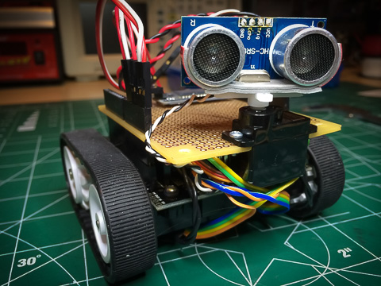

#WallBot Version 5

This version of WallBot is what version 4 should have been.

I've documented the development and build of the bot in these posts:

 * [Zumo Build - Part I](http://wp.me/p493sy-aI)
 * [Zumo Build - Part II](http://wp.me/p493sy-be)
 * [Zumo Build - Part III](http://wp.me/p493sy-bG)
 * [Zumo Build - Part IV](http://wp.me/p493sy-cw)
 * [Zumo Build - Redux](http://wp.me/p493sy-dA)
 

Parts list:
-----------

 * [Pololu's Zumo Kit](http://www.pololu.com/product/2505)
 * [Pololu's 100:1 HP metal micro-gear motors with extended shaft](http://www.pololu.com/product/2214)
 * [Pololu's optical encoders](http://www.pololu.com/product/2590)
 * Small/micro servo
 * Sonic Sensor - HC-SR04
 * Bluetooth Module
 
Overview
--------

This version of the bot enables PID control and support primitive dead-reckoning.

Read documentation for:

 * [PID Controller tuning](http://wp.me/p493sy-dQ)
 * [Simple dead reckoning support](http://wp.me/p493sy-ee)

Reference
=========

Arduino Pin Assignments
-----------------------

| Pin | Assignment              | Notes                             |
|:---:|-------------------------|-----------------------------------|
| 0   | USB/Serial/Bluetooth    | external comms                    |
| 1   | USB/Serial/Bluetooth    | external comms                    |
| 2   | Right Encoder (A)       |                                   |
| 3   | Right Encoder (B)       |                                   |
| 4   | Left Encode (A)         |                                   |
| 5   | Left Encode (B)         |                                   |
| 6   |                         |                                   |
| 7   | Right Motor Direction   |                                   |
| 8   | Left Motor Direction    |                                   |
| 9   | Right Motor PWM         |                                   |
| 10  | Left Motor PWM          |                                   |
| 11  |                         |                                   |
| 12  | Push Button             | toggle PID or stop/start bot      |
| 13  | Yellow LED              | indicates PID control             |
| A0  | Sonic Trig              |                                   |
| A1  | Sonic Echo              |                                   |
| A2  | Servo PWM               |                                   |
| A3  |                         |                                   |
| A4  | SDA                     | I2C                               |
| A5  | SCL                     | I2C                               |

  

